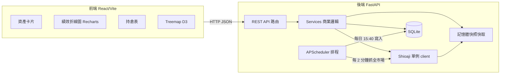

# 台股 Treemap Dashboard 架構設計與開發規劃

> 本文件為設計藍圖。確認後再依階段逐步實作。
> 參考來源：`CLAUDE.md`、`sino_API_full.md`、`stock_index/*.txt`。

## 1. 整體架構

核心原則：

- 前端永遠只讀後端 JSON，不直接碰 Shioaji。
- 全市場資料走 Event-driven（排程預抓進記憶體），前端請求只讀快取。
- Shioaji 全程單例（FastAPI lifespan 登入一次）。

## 2. 後端目錄結構 `backend/`

- `app/main.py`：建立 FastAPI、`lifespan`（登入 Shioaji、啟動排程、建表）、掛載路由、CORS。
- `app/config.py`：`pydantic-settings` 讀取專案根目錄既有的 `.env`（`SJ_API_KEY`、`SJ_SEC_KEY`）。
- `app/core/shioaji_client.py`：Shioaji 單例包裝，`login(fetch_contract=True)` / `logout`，提供 `api` 與 `stock_account`。
- `app/core/cache.py`：`cachetools.TTLCache` 工具（kbars、snapshot 用）。
- `app/db/database.py` + `models.py` + `init_db.py`：SQLAlchemy engine/session 與資料表。
- `app/schemas/`：Pydantic 回應模型（`account.py` / `market.py` / `history.py`）。
- `app/services/`：
  - `stock_universe.py`：載入 `stock_index/*.txt` → `{code: {name, industry, market}}`（啟動時讀一次）。
  - `snapshot_store.py`：全市場最新快照的記憶體字典 `{code: {close, change_rate, total_amount,...}}` + `last_updated`。
  - `account_service.py`：NAV 計算、整股/零股持倉合併。
  - `market_service.py`：Treemap 階層組裝、kbars（TTL 快取）。
  - `history_service.py`：讀 `daily_performance` 並標準化為 %。
- `app/scheduler/jobs.py` + `scheduler.py`：兩個排程任務（見第 5 節）。
- `app/api/routes_account.py` / `routes_market.py` / `routes_history.py`：端點。
- `backend/data/`：`app.db`（SQLite）。
- `backend/requirements.txt`、`backend/tests/`。

相依套件：`fastapi`、`uvicorn[standard]`、`shioaji`、`python-dotenv`、`pydantic-settings`、`sqlalchemy`、`apscheduler`、`cachetools`、`pytest`、`httpx`。

## 3. 資料庫設計（SQLite，自選清單與結算用 JSON 存）

- `daily_performance`：`date`(PK)、`nav`(float)、`price_0050`(float)、`price_2330`(float)、`created_at`。
- `kv_store`：`key`(PK)、`json_value`(TEXT) — 存自選清單（key=`watchlist`，值為 `["2330","0050",...]`）。
- `asset_snapshot`：`date`(PK)、`payload`(TEXT JSON) — 存當日資產/持倉/交割原始結算 JSON 備查。

## 4. API 端點契約

- `GET /api/account/assets` → 真實資產。
  公式：`NAV = acc_balance + 持倉總市值 + Σ(settlement.amount, T∈{1,2})`。
  說明：`settlements()` 的 `amount` 為帶號值（應付為負），相加即等同「扣除應扣交割款」；上線時用真實資料校驗一次。
  回傳：`{ nav, acc_balance, position_value, pending_settlement }`。
- `GET /api/account/positions` → 合併後持倉列表。
  合併邏輯：整股 `quantity`×1000 + 零股 `quantity`（股），市值 `last_price × 總股數`；以 `code` 為 key 合併。
- `GET /api/market/treemap?mode=market|watchlist` → 讀 `snapshot_store`，依產業別分層；`size`=成交值 `total_amount`、`color` 依 `change_rate`。
- `GET /api/market/kbars?code=2330&start=&end=` → `api.kbars()` 加 TTL 快取。
- `GET /api/history/performance` → 回傳 `我的資產 / 0050 / 2330` 三條已標準化(%)序列。

Treemap 權重採「成交值(total_amount)」為預設（市值需股本資料，現有清單未提供，先不採用）。

## 5. 排程任務（APScheduler）

- 全市場快照：每 2 分鐘，將 universe 代號分批（每批 ≤500 檔，批間留間隔避開 5 秒 50 次限流）呼叫 `api.snapshots()`，更新 `snapshot_store`。
- 每日結算：台灣時間 15:40，先檢查 2330 當日有開盤（snapshot close>0），計算 NAV、抓 0050/2330 收盤價，寫入 `daily_performance`。

## 6. 前端目錄結構 `frontend/`（Vite + React 19 + TypeScript）

- `src/api/client.ts`、`api/types.ts`：fetch 包裝與型別。
- `src/hooks/`：`useAssets`、`usePositions`、`useTreemap`、`usePerformance`（含輪詢間隔）。
- `src/components/`：
  - `layout/DashboardLayout.tsx`：頂部卡片列 + 左持倉 + 主 Treemap + 下方績效圖。
  - `cards/AssetCards.tsx`：真實總資產 / 帳戶餘額 / 持倉市值 / 待交割款。
  - `positions/PositionTable.tsx`。
  - `treemap/Treemap.tsx`（`d3.hierarchy`+`d3.treemap` 算幾何，React 渲染 SVG）+ `TreemapToggle.tsx`（全台股/自選）。
  - `performance/PerformanceChart.tsx`（Recharts，三條 % 曲線）。
- `src/lib/colors.ts`：美式漲跌色（漲綠 `#22c55e` / 跌紅 `#ef4444`）。
- `src/index.css`：`@import "tailwindcss";`；`vite.config.ts` 用 `@tailwindcss/vite`。
- 相依：`react`、`react-dom`、`d3`、`recharts`、`motion`、`lucide-react`、`@tailwindcss/vite`、`tailwindcss`、`typescript`。

## 7. 開發階段與測試方式（每階段完成後暫停確認）

- 階段 0 鷹架：建立前後端資料夾、相依、`/health`。測試：`uvicorn` 啟動 `/health` 回 ok；`npm run dev` 顯示空白 Dashboard。
- 階段 1 Shioaji 單例連線：lifespan 登入 + `/api/debug/status`。測試：呼叫回傳登入成功與帳戶、商品檔已載入。
- 階段 2 Universe + 快照排程：`stock_universe` 解析、`snapshot_store`、排程；`/api/market/snapshot-status` 顯示檔數與更新時間。測試：pytest 驗 txt 解析；端點顯示約 2000+ 檔且會更新。
- 階段 3 帳務端點：`/assets`、`/positions`。測試：pytest 用 mock 的整股/零股 list 驗合併與市值；curl 看實際 NAV 合理。
- 階段 4 行情端點：`/treemap`、`/kbars`。測試：treemap JSON 為合法階層；kbars 回 OHLC；快取命中測試。
- 階段 5 歷史 + 每日排程：手動觸發 job 寫入一列；`/history/performance` 回標準化序列；驗 2330 未開盤時跳過。
- 階段 6 前端串接：卡片/持倉/Treemap/績效圖綁資料、漲跌色、全台股/自選切換。測試：瀏覽器實測 + 比對後端數值。
- 階段 7 UI 收尾：Motion 動畫、RWD、Tooltip、載入/錯誤狀態。測試：手動互動驗收。

測試工具：後端 `pytest` + FastAPI `TestClient`（mock Shioaji）、即時用 curl 驗真實 API；前端瀏覽器手動驗收（必要時 `vitest`）。

## 8. 注意事項

- `.env` 已在專案根目錄，後端 `config.py` 指向根目錄載入；確保 `.env` 與 `backend/data/*.db` 列入 `.gitignore`。
- 所有帳務/行情呼叫集中在 service 層並受快取/排程保護，禁止路由直接打 Shioaji。
